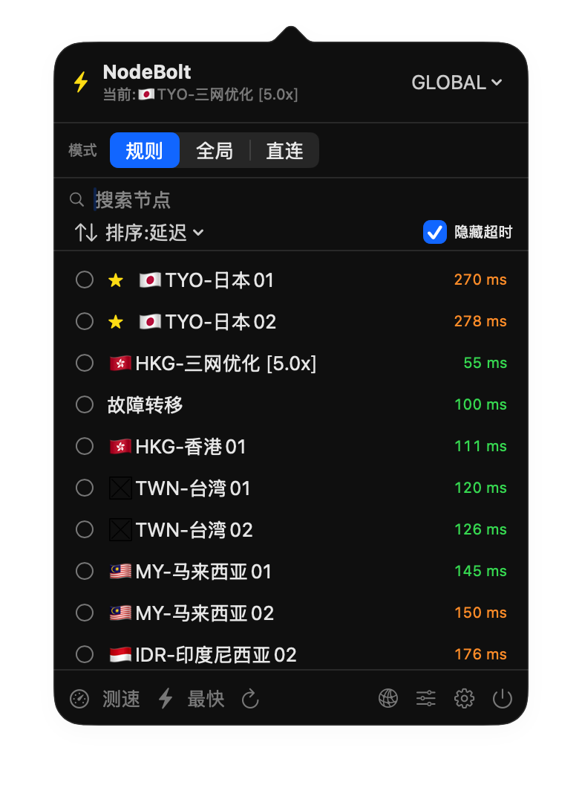
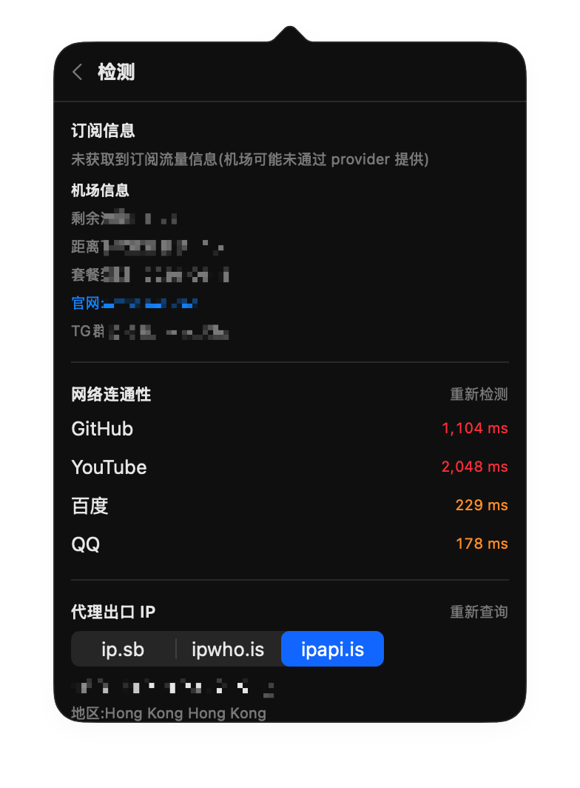
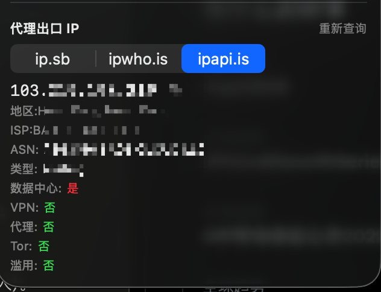
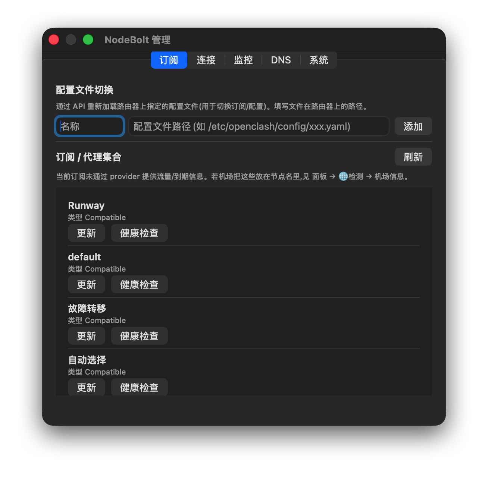

# ⚡ NodeBolt

**菜单栏里的 OpenClash 遥控器。**

不用开浏览器面板、不用 SSH 登录、不用翻路由器后台——点一下 Mac 菜单栏的 ⚡,
就能切节点、测延迟、看实时流量、查代理出口。家里路由器跑着 OpenClash / Mihomo,
你的 Mac 上就该有这么一个顺手的小开关。

> A menu-bar remote for your router's **Mihomo / OpenClash** — switch nodes, test latency,
> watch traffic, all from the macOS menu bar. No browser, no SSH.

| 主面板 | 节点检测 |
| :---: | :---: |
|  |  |
| **代理 IP 纯净度** | **管理窗口** |
|  |  |

## 为什么是它

- **够快**:换节点从"开网页 → 登录 → 找半天"变成"菜单栏点一下"。
- **够干净**:全程只走 Mihomo 的 RESTful API,**不碰 SSH、不改你的路由器配置**,只用你给的地址和密钥。
- **够轻**:原生 SwiftUI,几 MB,常驻菜单栏,秒开、不吃内存。

## 功能一览

**切节点,顺手**
- 菜单栏弹面板,所有节点一览,延迟彩色标注一眼看快慢
- 点一下即切,**面板不收起**,接着挑下一个
- 搜索、收藏置顶、按延迟/名称排序、一键隐藏超时节点
- 「⚡ 最快」直接切到延迟最低;规则 / 全局 / 直连 模式秒切

**测速,快且全**
- 整组原生测速(一次请求测全组)、单节点测速、打开面板自动测、定时自动测
- 逐节点转圈出结果,绿 / 橙 / 红 / 超时 一目了然

**检测,验证代理到底通不通**
- 一键测 GitHub / YouTube / 百度 / QQ 的连通性与延迟
- 代理出口 IP 三源对比(ip.sb / ipwho.is / ipapi.is),连**是不是机房 IP / VPN / 代理 / 风险 IP** 都帮你查

**管理,该有的都有(管理窗口)**
- 订阅:列出、更新、健康检查;配置文件按路径一键切换
- 连接:实时活动连接、搜索、关闭单个 / 全部
- 实时监控:上下行速率、内存占用、滚动日志
- DNS 查询、清 FakeIP、内核版本、更新 GEO、重启 / 升级内核(高危二次确认)

**贴心细节**
- 菜单栏直接显示当前节点 / 代理实时网速(也可只显示图标,或完全隐藏)
- 自定义全局快捷键:一键切最快 / 呼出面板
- 多套连接档案:家里、公司一键切换
- 开机自启、节点掉线系统通知、切换 Wi-Fi 自动重连

## 环境要求

- **系统**:macOS 14 (Sonoma) 或更高
- **CPU**:Universal —— **Apple Silicon(M 系列)与 Intel 均可**
- **内核**:支持 RESTful 外部控制器的 **Mihomo / Clash.Meta**(已在 **v1.19.x** 实测;OpenClash 自带内核即可),并已开启外部控制器(API 地址 + Secret)

## 安装

1. 到 [Releases](../../releases) 下载 `NodeBolt.dmg`,打开后把 **NodeBolt** 拖进**应用程序**。
2. 首次打开:**右键 App →「打开」**(未签名构建,需一次性放行 Gatekeeper)。
3. 出现提示时**允许「本地网络」**(用来连你路由器的 API)。
4. 点菜单栏 ⚡ → ⚙ 设置,填入 **API 地址**(如 `http://192.168.x.x:9090`)和 **Secret**,完事。

## 源码构建

需要 Swift 工具链(完整 Xcode 或仅 Command Line Tools):

```bash
git clone https://github.com/zhangwenqiang0214/NodeBolt.git
cd NodeBolt
./build.sh          # 编译并打包 dist/NodeBolt.app(Universal)
./package_dmg.sh    # 生成 dist/NodeBolt.dmg
./run_tests.sh      # 对本地 mock 跑集成测试
```

## 路线图

`v0.1.0` 已发布。接下来计划:

- 🔏 代码签名 + 公证 —— 双击即装,不用再右键打开
- 🍺 Homebrew Cask —— `brew install --cask nodebolt` 一键安装
- 🔑 Secret 存进系统钥匙串(Keychain),不再明文落盘
- 🌐 中英文双语界面
- 📈 延迟历史曲线、节点分组视图、更多快捷键动作

有想法或遇到问题,欢迎提 [Issue](../../issues)。

## 技术

SwiftUI + AppKit,Swift Package Manager。只通过 Mihomo 的 RESTful API 通信(不用 SSH),网络层与本地 mock 服务做了集成测试。详见 [docs/ROADMAP.md](docs/ROADMAP.md)。

## License

[MIT](LICENSE) © 2026 zhangwenqiang
